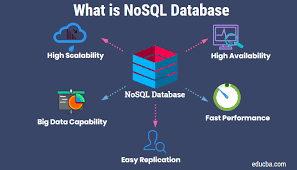

# Rossetti-s-NoSQL-Challenge-Social-Network-API

<a name="readme-top"></a>

[![Contributors][contributors-shield]][contributors-url]

<br />
<div align="center">
<a href="https://github.com/stephenrossetti/Rossetti-s-NoSQL-Challenge-Social-Network-API">

</a>

<h3 align="r">NoSQL Challenge Social Network API</h3>
<p align="center">
    Watch demo video here!
<br />

<br />
<a href="https://drive.google.com/file/d/1NkRFCykr_PVfF-NlXsFeVY7Ua7NmY0jT/view">View Demo</a>
    ·
<a href="https://github.com/stephenrossetti/Rossetti-s-NoSQL-Challenge-Social-Network-API/issues">Report Bug</a>
    ·
<a href="https://github.com/stephenrossetti/Rossetti-s-NoSQL-Challenge-Social-Network-API/issues">Request Feature</a>
  </p>
</div>


<details>
<summary>Table of Contents</summary>
<ol>
<li><a href="#overview-of-nosql-social-network-api">Overview of NoSQL Social Network API</a></li>
<li><a href="#user-story">User Story</a></li>
<li><a href="#acceptance-criteria">Acceptance Criteria</a></li>
<li><a href="#getting-started">Getting Started</a><li>
<ul>
<li><a href="#prerequisites">Prerequisites</a></li>
<li><a href="#installation">Installation</a></li>
</ul>
</li>
<li><a href="#built-with-&-technology-used">Technology Used</a></li>
<li><a href="#usage">Usage</a></li>
<li><a href="#links">Links</a></li>
<li><a href="#contributing">Contributing</a></li>
<li><a href="#license">License</a></li>
<li><a href="#contact-us">Contact Us </a></li>
<li><a href="#credits">Credits</a></li>
<li><a href="#acknowledgments">Acknowledgments</a></li>
</ol>
</details>

## Overview of Rossetti's NoSQL Social Network API

NoSQL Challenge: Social Network API, or Module-18's Challenge, was to build an API for a social network web application where users can share their thoughts, react to friends’ thoughts, and create a friend list. This API was built completely from scratch and tested in Insomnia and run in MongoDB Compass. The challenge uses Express.js for routing, a MongoDB database, and the Mongoose ODM. In addition to using the Express.js and Mongoose packages, the challenge also uses JavaScript date library to format timestamps.

Along with other skills learned in previous challenges, this challenge tested our ability to utilize NoSQL, Mongoose ODM, Express,Schemas/Models, and MongoDB connections.

## User Story

```
AS A social media startup
I WANT an API for my social network that uses a NoSQL database
SO THAT my website can handle large amounts of unstructured data
```

## Acceptance Criteria

```
GIVEN a social network API
WHEN I enter the command to invoke the application
THEN my server is started and the Mongoose models are synced to the MongoDB database
WHEN I open API GET routes in Insomnia for users and thoughts
THEN the data for each of these routes is displayed in a formatted JSON
WHEN I test API POST, PUT, and DELETE routes in Insomnia
THEN I am able to successfully create, update, and delete users and thoughts in my database
WHEN I test API POST and DELETE routes in Insomnia
THEN I am able to successfully create and delete reactions to thoughts and add and remove friends to a user’s friend list
```

<p align="right">(<a href="#readme-top">back to top</a>)</p>

## Built With & Technology Used

- 

- 

- 

- 

- 

## Getting Started

How to get started with the Social Network API!

### Prerequisites

- npm
- Insomnia
- MongoDB Compass

### Installation

Instructions on how to download our app.

1. Visit us @ [https://github.com/stephenrossetti](https://github.com/stephenrossetti/Rossetti-s-NoSQL-Challenge-Social-Network-API)
2. Clone the repo
   ```sh
   git clone git@github.com:stephenrossetti/Rossetti-s-NoSQL-Challenge-Social-Network-API.git
   ```
3. Install NPM packages

   ```sh
   npm install i
   ```

4. To run our app

   ```sh
   nodemon server.js
   ```

5. Run and connect to MongoDB Compass

6. Run and connect to Insomnia 

   ```sh
   http://localhost:3001/api/
   ```

<p align="right">(<a href="#readme-top">back to top</a>)</p>

## Usage


## Links
[The URL of the demo](https://drive.google.com/file/d/1NkRFCykr_PVfF-NlXsFeVY7Ua7NmY0jT/view)

[The URL of the Github Repository](https://github.com/stephenrossetti/Rossetti-s-NoSQL-Challenge-Social-Network-API)

<p align="right">(<a href="#readme-top">back to top</a>)</p>

## Contributing

Here is how you can be apart of creating Social Network API.

1. Fork the Project
2. Create your Feature Branch (`git checkout -b [BRANCH NAME]`)
3. Commit your Changes (`git commit -m 'Add my commits to main'`)
4. Push to the Branch (`git push origin main`)
5. Open a Pull Request

<p align="right">(<a href="#readme-top">back to top</a>)</p>

## License

N/A

<p align="right">(<a href="#readme-top">back to top</a>)</p>

## Contact Us

Contact me ([Stephen Rossetti](https://github.com/stephenrossetti)) if you have any questions or feedback.

<p align="right">(<a href="#readme-top">back to top</a>)</p>

## Credits

Coding help from external sources:

- Utilized Module-26-Activity as a template to begin coding the API. Included most of the functionality including, but not limited to, the configuration, models, controllers, routes, etc. Code was updated for challenge requirements.
- Utilized TAs for debugging help with deleting associated thoughts and reactions when a user or thought was deleted.
- Utilized StackOverflow for miscellaneous code help. Specifically the date formatting.

<p align="right">(<a href="#readme-top">back to top</a>)</p>

## Acknowledgments

Thanks to our resources on creating our app!

- [Visual Studio Code](https://code.visualstudio.com/)
- [Insomnia](https://img.shields.io/badge/Insomnia-black?style=for-the-badge&logo=insomnia&logoColor=5849BE)
- [Static Badges](https://shields.io/badges)

<p align="right">(<a href="#readme-top">back to top</a>)</p>

[contributors-shield]:https://img.shields.io/badge/CONTRIBUTORS%20--4?style=for-the-badge&logo=gitlab&labelColor=WHITE
[contributors-url]: https://github.com/stephenrossetti/Rossetti-s-NoSQL-Challenge-Social-Network-API/graphs/contributors
